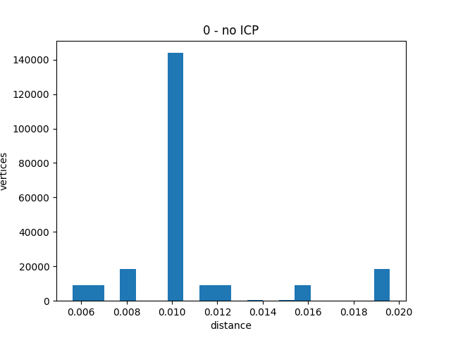
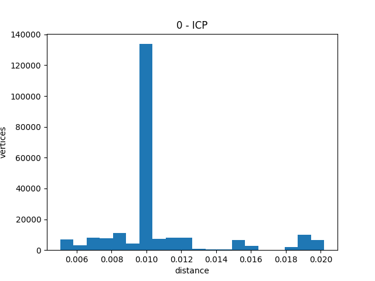
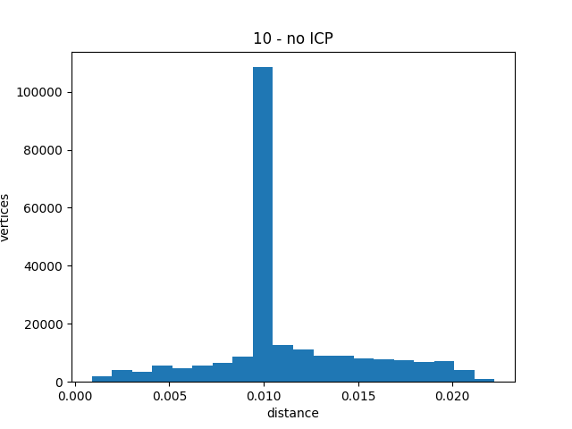

# cli

```shell
python cli.py data --num 100 --vox-size 0.02
```

# Параметры

Коробка размером 1x1x2 по осях X, Y, Z. Центр в (0, 0, 0).

Размер вокселя 0.01

Поворот делается по оси (0, 0, 1)

# Результаты

|  Поворот | ICP                | Расстояние |
|---------:|--------------------|-----------:|
|        0 |                    |      0.005 |
|        0 | :heavy_check_mark: |      0.005 |
| 10&#xb0; |                    |      0.011 |
| 10&#xb0; | :heavy_check_mark: |      0.011 |

## Без поворота, без ICP


## Без поворота, с ICP


## Поворот 10&#xb0;, без ICP


## Поворот 10&#xb0;, с ICP


# Параметры


Размеры 4.8x4.8x0.8.
Размер вокселя - 0.02.

# Результаты

|  Поворот | ICP                | Расстояние |
|---------:|--------------------|-----------:|
|        0 |                    |      0.020 |
|        0 | :heavy_check_mark: |      0.020 |
| 10&#xb0; |                    |      0.022 |
| 10&#xb0; | :heavy_check_mark: |      0.022 |








