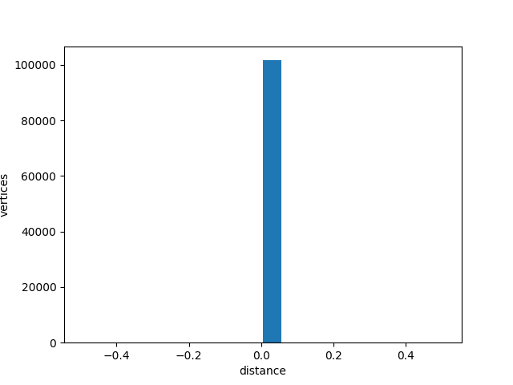
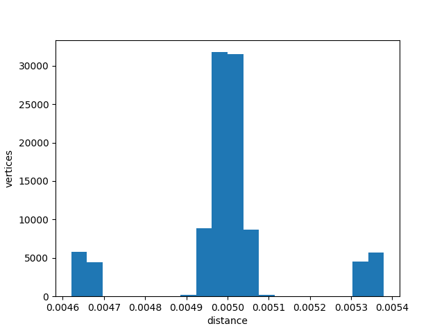
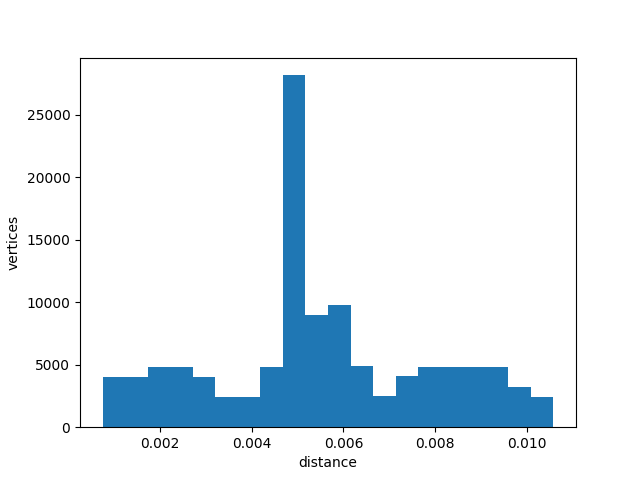
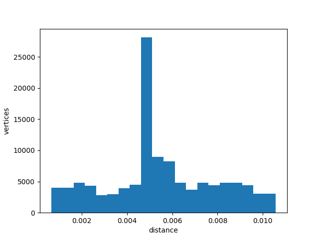

# Параметры

Коробка размером 1x1x2 по осях X, Y, Z. Центр в (0, 0, 0).

Размер вокселя 0.01

# Результаты

|  Поворот | ICP                | Расстояние |
|---------:|--------------------|-----------:|
|        0 |                    |      0.005 |
|        0 | :heavy_check_mark: |      0.005 |
| 10&#xb0; |                    |      0.011 |
| 10&#xb0; | :heavy_check_mark: |      0.011 |

## Без поворота, без ICP

## Без поворота, с ICP

## Поворот 10&#xb0;, без ICP

## Поворот 10&#xb0;, с ICP

