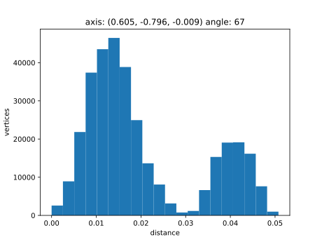
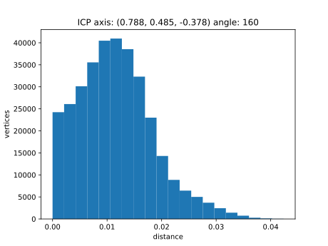
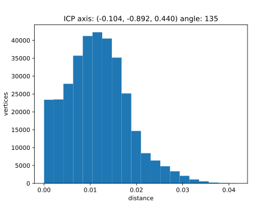
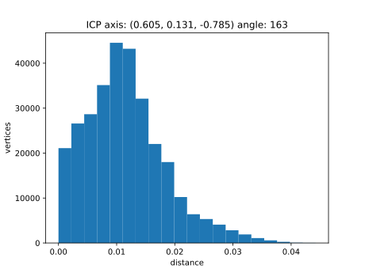
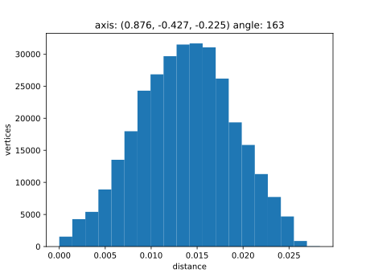

```shell
python cli.py data --num 100 --vox-size 0.02
```

# Параметры


Размеры 4.8x4.8x0.8

Размер вокселя - 0.02

Центр - (0, 0, 0)

[БД с результатами](static/data.db)

# 10 с максимальным отклонением без ICP

|  id | угол | максимальное расстояние | квантиль 0.90 | квантиль 0.95 | квантиль 0.99 | максимальное расстояние ICP | квантиль 0.90 ICP | квантиль 0.95 ICP | квантиль 0.99 ICP |
|----:|-----:|------------------------:|--------------:|--------------:|--------------:|----------------------------:|------------------:|------------------:|------------------:|
|  27 |  155 |                   0.062 |         0.052 |         0.055 |         0.058 |                       0.038 |             0.020 |             0.023 |             0.028 |
|  50 |  152 |                   0.058 |         0.045 |         0.049 |         0.053 |                       0.037 |             0.019 |             0.022 |             0.028 |
| 106 |  156 |                   0.053 |         0.043 |         0.046 |         0.050 |                       0.039 |             0.020 |             0.023 |             0.029 |
| 154 |  147 |                   0.053 |         0.044 |         0.047 |         0.050 |                       0.038 |             0.020 |             0.023 |             0.029 |
| 186 |  173 |                   0.053 |         0.044 |         0.047 |         0.050 |                       0.037 |             0.020 |             0.022 |             0.028 |
|  37 |   67 |                   0.051 |         0.042 |         0.044 |         0.047 |                       0.043 |             0.021 |             0.024 |             0.031 |
|  76 |  160 |                   0.051 |         0.042 |         0.044 |         0.047 |                       0.042 |             0.020 |             0.024 |             0.031 |
| 184 |  151 |                   0.048 |         0.037 |         0.040 |         0.044 |                       0.037 |             0.020 |             0.022 |             0.028 |
| 115 |  135 |                   0.047 |         0.039 |         0.041 |         0.044 |                       0.042 |             0.020 |             0.024 |             0.030 |
| 167 |  174 |                   0.046 |         0.036 |         0.039 |         0.043 |                       0.041 |             0.020 |             0.024 |             0.030 |

# 10 с максимальным отклонением с ICP

|  id | угол | максимальное расстояние | квантиль 0.90 | квантиль 0.95 | квантиль 0.99 | максимальное расстояние ICP | квантиль 0.90 ICP | квантиль 0.95 ICP | квантиль 0.99 ICP |
|----:|-----:|------------------------:|--------------:|--------------:|--------------:|----------------------------:|------------------:|------------------:|------------------:|
| 134 |  163 |                   0.028 |         0.021 |         0.022 |         0.025 |                       0.047 |             0.021 |             0.025 |             0.033 |
|   8 |  126 |                   0.028 |         0.021 |         0.023 |         0.025 |                       0.045 |             0.020 |             0.026 |             0.033 |
| 162 |  114 |                   0.039 |         0.028 |         0.031 |         0.036 |                       0.045 |             0.021 |             0.025 |             0.032 |
|  82 |  132 |                   0.026 |         0.020 |         0.021 |         0.023 |                       0.044 |             0.021 |             0.025 |             0.032 |
| 119 |  163 |                   0.039 |         0.029 |         0.032 |         0.036 |                       0.044 |             0.020 |             0.025 |             0.032 |
| 153 |  136 |                   0.028 |         0.021 |         0.022 |         0.024 |                       0.044 |             0.021 |             0.025 |             0.032 |
|  37 |   67 |                   0.051 |         0.042 |         0.044 |         0.047 |                       0.043 |             0.021 |             0.024 |             0.031 |
|  58 |  140 |                   0.024 |         0.019 |         0.021 |         0.022 |                       0.043 |             0.020 |             0.024 |             0.031 |
|  86 |  105 |                   0.039 |         0.030 |         0.033 |         0.036 |                       0.043 |             0.020 |             0.024 |             0.031 |
| 129 |  120 |                   0.044 |         0.033 |         0.036 |         0.038 |                       0.043 |             0.021 |             0.025 |             0.032 |

# id 8


# id 27


# id 37




# id 50


# id 58


# id 76




# id 82


# id 86


# id 106


# id 115




# id 119




# id 129


# id 134




# id 153


# id 154


# id 162


# id 167


# id 184


# id 186


