# Проекции

- Размеры фантома: 245 x 245 x 245
- Размер вокселя: 0.2 мм
- Размеры детектора: 256 x 256
- Размер элемента детектора: 0.5 мм x 0.5 мм
- 180 проекций
- sid: 540 мм
- sdd: 950 мм

    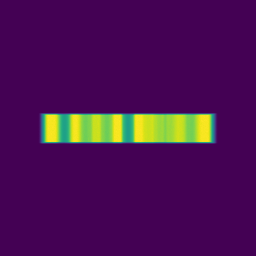
    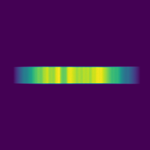
    

    
    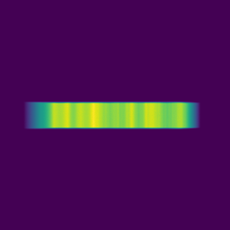
    

    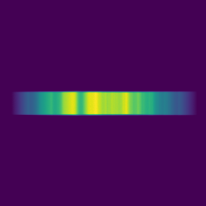
    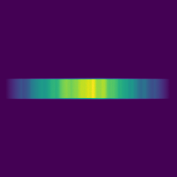
    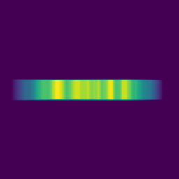

# Реконструкции

Алгоритм FDK

Размер изображения 256

Количество слоёв - 256, расстояние между слоями 0.2 мм

fov = 50.0

z = 103

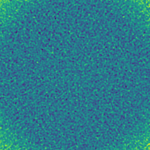

z = 104

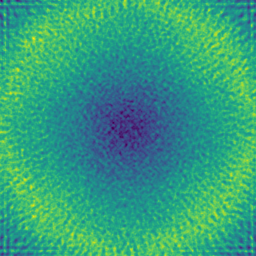

z = 105

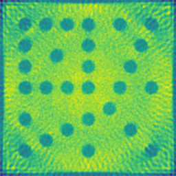

z = 106

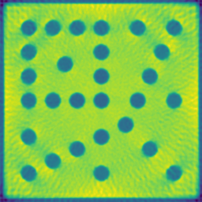

z = 128

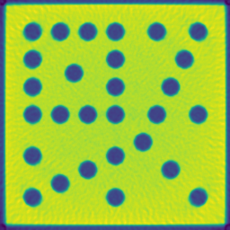

z = 149

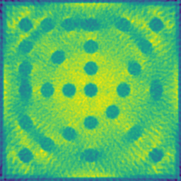

z = 150

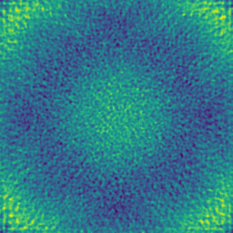
